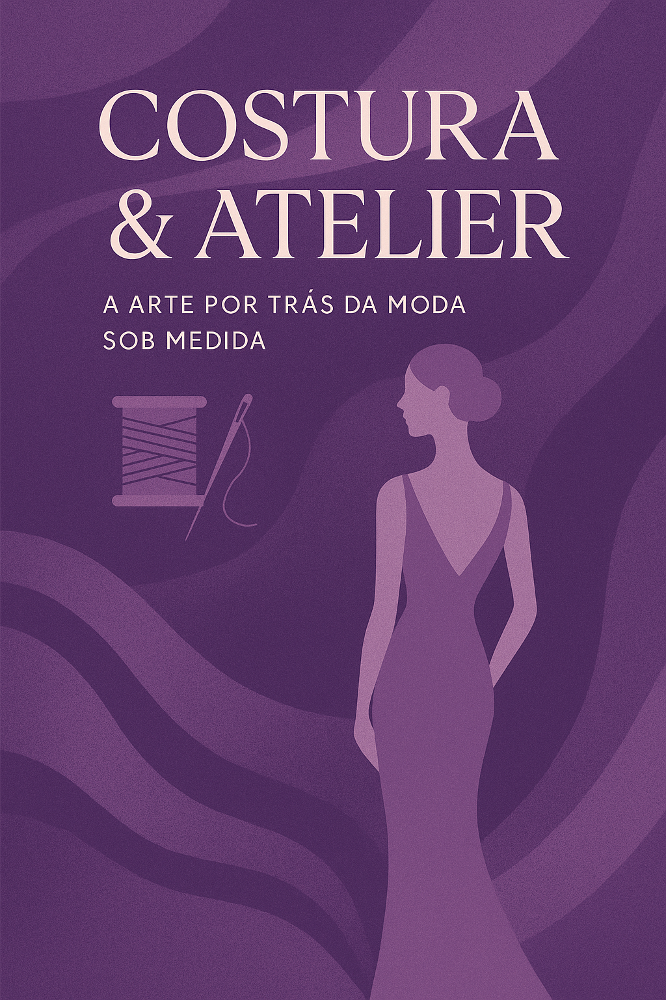

    

-------

# eBook criado utilizando ChatGPT e CANVA

 > ℹ️ **NOTA:** SEM FINS LUCRATIVOS

Projeto com o objetivo de gerar um ebook com as facilidades do ChatGPT e CANVA.

<a href="https://www.instagram.com/atelier_quelferreira/assets/eBook_Atelier_Raquel_Ferreira.pdf" title="View PDF now"> 📕Clique aqui para ler</a>

## 💻 Tecnologias utilizadas no projeto

- [ChatGPT](https://chat.openai.com/) 
- [CANVA](https://www.canva.com/)

## 🧠 Prompts

ChatGPT：

|   Ação   | prompt                                                                                                                                                                                                                                                                         |
| :------: | ------------------------------------------------------------------------------------------------------------------------------------------------------------------------------------------------------------------------------------------------------------------------------ |
|  ideia   | Quero criar um ebook falando sobre Atelier de Costura, mas não sei como dividir em topicos. O Objetivo do ebook é explicar porquer uma roupa sob medida custa mais caro do que uma roupa comprada em uma loja.
|  capa    | Gostaria de uma capa , com a cor pricipal sendo o roxo, contendo o titulo sugerido. Pode gerar uma imagem?

## ✨ Features

- Conteúdo gerado via ChatGPT
- Imagem gerada via ChatGPT
- Estrutura gerada via CANVA

## 📚 Materiais

- Imagem utilizada em `assets`
- eBook gerado em `assets`

## 🛠️ Instruções de execução

Utilize os prompts acima no ChatGPT para gerar o material base e utilize uma ferramenta de edição de documentos como power point, libreoffice ou CANVA para diagramação.

## 👨‍💻 Expert

    
    
&nbsp&nbsp&nbspWillyan Ferreira 
    &nbsp&nbsp&nbsp
    <a href="https://github.com/willyanferreira">
    GitHub</a>&nbsp;|&nbsp;
    <a href="https://www.linkedin.com/in/willyan-cfdss/">LinkedIn</a>
&nbsp;|&nbsp;
    <a href="https://www.instagram.com/willyan3rha/">
    Instagram</a>
&nbsp;|&nbsp;

  

---

⌨️ com 💜 por [Willyan Ferreira](https://github.com/willyanferreira)
